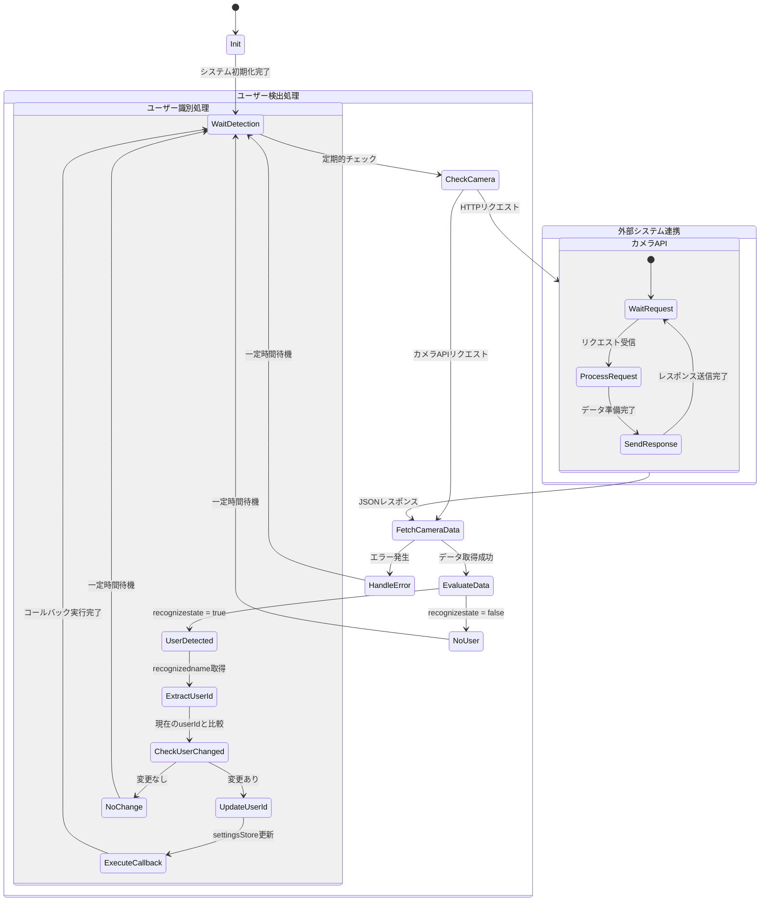

```mermaid
stateDiagram-v2
    [*] --> Init
    Init --> WaitDetection: システム初期化完了

    state "ユーザー検出処理" as UserDetectProcess {
        WaitDetection --> CheckCamera: 定期的チェック
        CheckCamera --> FetchCameraData: カメラAPIリクエスト
        FetchCameraData --> EvaluateData: データ取得成功
        FetchCameraData --> HandleError: エラー発生
        
        EvaluateData --> NoUser: recognizestate = false
        EvaluateData --> UserDetected: recognizestate = true
        
        NoUser --> WaitDetection: 一定時間待機
        HandleError --> WaitDetection: 一定時間待機
        
        state "ユーザー識別処理" as UserIdentifyProcess {
            UserDetected --> ExtractUserId: recognizedname取得
            ExtractUserId --> CheckUserChanged: 現在のuserIdと比較
            
            CheckUserChanged --> UpdateUserId: 変更あり
            CheckUserChanged --> NoChange: 変更なし
            
            UpdateUserId --> ExecuteCallback: settingsStore更新
            ExecuteCallback --> WaitDetection: コールバック実行完了
            
            NoChange --> WaitDetection: 一定時間待機
        }
    }

    state "外部システム連携" as ExternalSystem {
        state "カメラAPI" as CameraAPI {
            [*] --> WaitRequest
            WaitRequest --> ProcessRequest: リクエスト受信
            ProcessRequest --> SendResponse: データ準備完了
            SendResponse --> WaitRequest: レスポンス送信完了
        }
    }
    
    CheckCamera --> CameraAPI: HTTPリクエスト
    CameraAPI --> FetchCameraData: JSONレスポンス
```