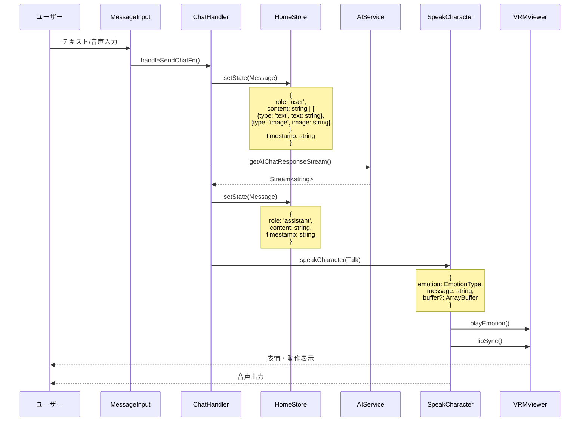

```mermaid
sequenceDiagram
    participant User as ユーザー
    participant Input as MessageInput
    participant Handler as ChatHandler
    participant Store as HomeStore
    participant AI as AIService
    participant Speaker as SpeakCharacter
    participant VRM as VRMViewer

    %% メッセージ入力フロー
    User->>Input: テキスト/音声入力
    Input->>Handler: handleSendChatFn()
    
    %% メッセージ処理フロー
    Handler->>Store: setState(Message)
    Note over Store: {<br/>role: 'user',<br/>content: string | [<br/>{type: 'text', text: string},<br/>{type: 'image', image: string}<br/>],<br/>timestamp: string<br/>}

    Handler->>AI: getAIChatResponseStream()
    AI-->>Handler: Stream<string>

    %% レスポンス処理フロー
    Handler->>Store: setState(Message)
    Note over Store: {<br/>role: 'assistant',<br/>content: string,<br/>timestamp: string<br/>}

    %% 音声・表情処理フロー
    Handler->>Speaker: speakCharacter(Talk)
    Note over Speaker: {<br/>emotion: EmotionType,<br/>message: string,<br/>buffer?: ArrayBuffer<br/>}
    
    Speaker->>VRM: playEmotion()
    Speaker->>VRM: lipSync()

    %% フィードバック
    VRM-->>User: 表情・動作表示
    Speaker-->>User: 音声出力
```