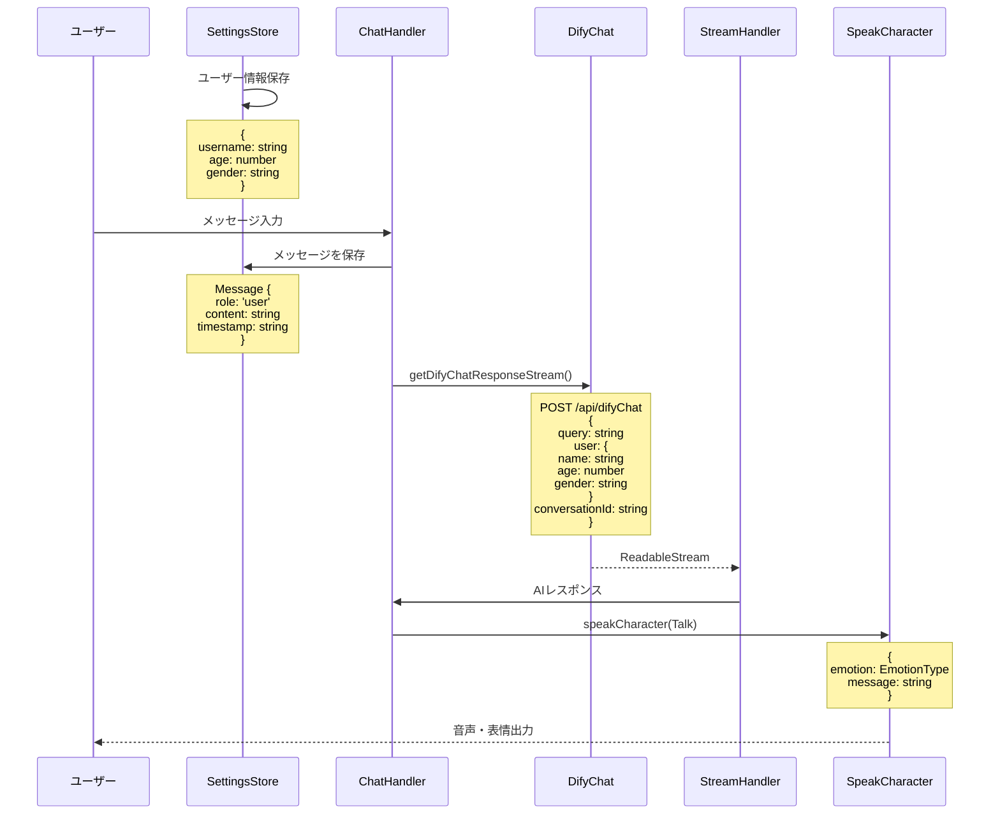

```mermaid
sequenceDiagram
    participant User as ユーザー
    participant Store as SettingsStore
    participant Handler as ChatHandler
    participant DifyAPI as DifyChat
    participant Stream as StreamHandler
    participant Speaker as SpeakCharacter

    %% ユーザー情報の流れ
    Store->>Store: ユーザー情報保存
    Note over Store: {<br/>username: string<br/>age: number<br/>gender: string<br/>}

    %% メッセージ入力フロー
    User->>Handler: メッセージ入力
    Handler->>Store: メッセージを保存
    Note over Store: Message {<br/>role: 'user'<br/>content: string<br/>timestamp: string<br/>}

    %% Dify APIとの連携
    Handler->>DifyAPI: getDifyChatResponseStream()
    Note over DifyAPI: POST /api/difyChat<br/>{<br/>query: string<br/>user: {<br/>  name: string<br/>  age: number<br/>  gender: string<br/>}<br/>conversationId: string<br/>}

    %% レスポンスストリーム処理
    DifyAPI-->>Stream: ReadableStream
    Stream->>Handler: AIレスポンス

    %% 音声・感情処理
    Handler->>Speaker: speakCharacter(Talk)
    Note over Speaker: {<br/>emotion: EmotionType<br/>message: string<br/>}

    %% フィードバック
    Speaker-->>User: 音声・表情出力
```