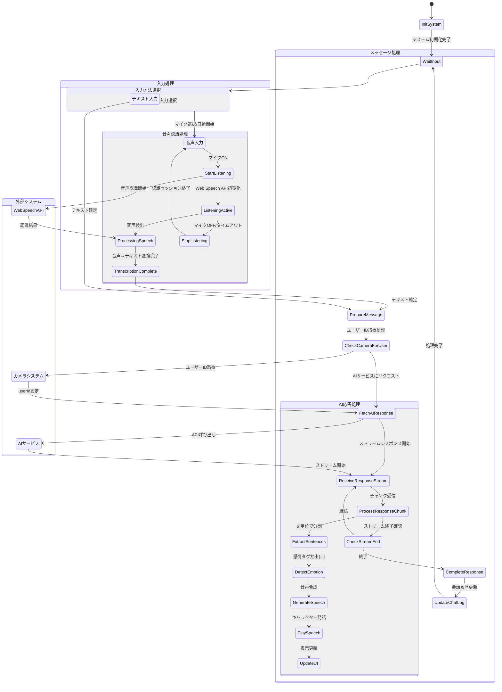

```mermaid
stateDiagram-v2
    [*] --> InitSystem
    InitSystem --> WaitInput: システム初期化完了
    
    state "入力処理" as InputProcess {
        WaitInput --> InputSelection
        
        state "入力方法選択" as InputSelection {
            state "テキスト入力" as TextInput
            state "音声入力" as VoiceInput
            
        }        
        
        state "音声認識処理" as SpeechRecognition {
            VoiceInput --> StartListening: マイクON
            StartListening --> ListeningActive: Web Speech API初期化
            ListeningActive --> ProcessingSpeech: 音声検出
            ProcessingSpeech --> TranscriptionComplete: 音声→テキスト変換完了
            TranscriptionComplete --> PrepareMessage: テキスト確定
            
            ListeningActive --> StopListening: マイクOFF/タイムアウト
            StopListening --> VoiceInput: 認識セッション終了
        }
    }
    InputSelection --> TextInput: テキスト入力選択
    InputSelection --> VoiceInput: マイク選択/自動開始
    TextInput --> PrepareMessage: テキスト確定
    
    state "メッセージ処理" as MessageProcess {
        PrepareMessage --> CheckCameraForUser: ユーザーID取得処理
        CheckCameraForUser --> FetchAIResponse: AIサービスにリクエスト
        
        state "AI応答処理" as AIResponseProcess {
            FetchAIResponse --> ReceiveResponseStream: ストリームレスポンス開始
            ReceiveResponseStream --> ProcessResponseChunk: チャンク受信
            ProcessResponseChunk --> ExtractSentences: 文単位で分割
            ExtractSentences --> DetectEmotion: 感情タグ抽出[...]
            DetectEmotion --> GenerateSpeech: 音声合成
            GenerateSpeech --> PlaySpeech: キャラクター発話
            PlaySpeech --> UpdateUI: 表示更新
            
            ProcessResponseChunk --> CheckStreamEnd: ストリーム終了確認
            CheckStreamEnd --> ReceiveResponseStream: 継続
            CheckStreamEnd --> CompleteResponse: 終了
        }
        
        CompleteResponse --> UpdateChatLog: 会話履歴更新
        UpdateChatLog --> WaitInput: 処理完了
    }
    
    state "外部システム" as ExternalSystems {
        state "WebSpeechAPI" as WebSpeechAPI
        state "AIサービス" as AIService
        state "カメラシステム" as CameraSystem
    }
    
    StartListening --> WebSpeechAPI: 音声認識開始
    WebSpeechAPI --> ProcessingSpeech: 認識結果
    
    CheckCameraForUser --> CameraSystem: ユーザーID取得
    CameraSystem --> FetchAIResponse: userId設定
    
    FetchAIResponse --> AIService: API呼び出し
    AIService --> ReceiveResponseStream: ストリーム開始
```